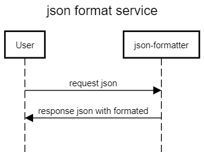

# Json Formatter
_API for Json Format_
## What is Json Formatter
Json Formatter helps you create a format json message. Json Formatter base on Java language.
## Installation
Json Formatter requires [Java] v8+ to run
## How to Use
This API can format your json formated. first, you must deploy locally, with java required.

## Architecture and Design diagrams


## Example

- **Sample curl Api for json formatter**

_Request :_
```sh
curl -X POST "http://localhost:8080/api/v1/json/lite" -H "accept: */*" -H "Content-Type: application/json" -d "{ \"data\": [ { \"name\": \"MSISDN\", \"value\": \"628387xxxxx\" }, { \"name\": \"subscriberNumber\", \"value\": \"146288xxx\" }, { \"name\": \"ESBUUID\", \"value\": \"UESB07.05-e6390dad-8521-4e6c-9e7b-c3f042dcd76eh\" }, { \"name\": \"ServiceIdParent\", \"value\": \"321xxx\" }, { \"name\": \"ServiceId\", \"value\": \"3214xxx\" }, { \"name\": \"ContactSource\", \"value\": \"\" }, { \"name\": \"ContactType\", \"value\": \"\" }, { \"name\": \"SendSmsFromSOA\", \"value\": \"false\" }, { \"name\": \"domain\", \"value\": \"axis\" }, { \"name\": \"eventGeneratorSystem\", \"value\": \"cpVoucherManagementV2_0\" }, { \"name\": \"eventType\", \"value\": \"redeem\" }, { \"name\": \"object\", \"value\": \"voucher\" }, { \"name\": \"payloadType\", \"value\": \"notification\" }, { \"name\": \"sourceId\", \"value\": \"Process_Archive_Callback_2\" }, { \"name\": \"touchpoint\", \"value\": \"UAX\" }, { \"name\": \"completionStatus\", \"value\": \"Success\" }, { \"name\": \"exceptionCode\", \"value\": \"\" }, { \"name\": \"exceptionName\", \"value\": \"\" }, { \"name\": \"exceptionDescription\", \"value\": \"\" } ]}"
```

_Response :_
```sh
{"data":[{"name":"MSISDN","value":"628387xxxxx"},{"name":"subscriberNumber","value":"146288xxx"},{"name":"ESBUUID","value":"UESB07.05-e6390dad-8521-4e6c-9e7b-c3f042dcd76eh"},{"name":"ServiceIdParent","value":"321xxx"},{"name":"ServiceId","value":"3214xxx"},{"name":"ContactSource","value":""},{"name":"ContactType","value":""},{"name":"SendSmsFromSOA","value":"false"},{"name":"domain","value":"axis"},{"name":"eventGeneratorSystem","value":"cpVoucherManagementV2_0"},{"name":"eventType","value":"redeem"},{"name":"object","value":"voucher"},{"name":"payloadType","value":"notification"},{"name":"sourceId","value":"Process_Archive_Callback_2"},{"name":"touchpoint","value":"UAX"},{"name":"completionStatus","value":"Success"},{"name":"exceptionCode","value":""},{"name":"exceptionName","value":""},{"name":"exceptionDescription","value":""}]}
```
## Contribution

You are welcome to contribute to the project with pull requests on this repo.

### Awesome contributors

* [Banu Salman Farisi](mailto:banus@xl.co.id)


### Reference Documentation
For further reference, please consider the following sections:

* [Official Apache Maven documentation](https://maven.apache.org/guides/index.html)
* [Spring Boot Maven Plugin Reference Guide](https://docs.spring.io/spring-boot/docs/2.5.7/maven-plugin/reference/html/)
* [Create an OCI image](https://docs.spring.io/spring-boot/docs/2.5.7/maven-plugin/reference/html/#build-image)

## Project Description Updated by - RMT Admin

1. Description of the code – a summary of the functionality (with key technical words) - API for formatter JSON
2. Used languages and versions - Spring Boot
3. Used databases and version - no
4. Used 3rd party libraries and versions - <br>			
https://mvnrepository.com/artifact/org.springframework.boot/spring-boot-starter-web <br>
https://mvnrepository.com/artifact/org.projectlombok/lombok <br>
https://mvnrepository.com/artifact/io.springfox/springfox-swagger-ui <br>
https://mvnrepository.com/artifact/io.springfox/springfox-swagger2"
